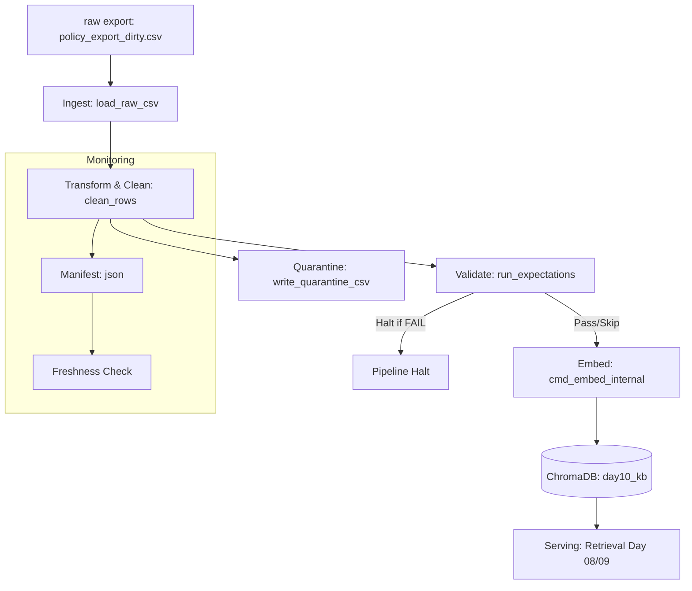

# Kiến trúc pipeline — Lab Day 10

**Người thực hiện:** Phạm Thanh Hằng  
**Cập nhật:** 2026-06-10

---

## 1. Sơ đồ luồng

- **Điểm đo Freshness:** Đo tại bước `publish` dựa trên thời gian xuất dữ liệu lớn nhất (`latest_exported_at`) trong manifest so với thời gian chạy batch.
- **Vùng Quarantine:** Chứa các bản ghi không đạt Schema/Business Rules để phân tích lỗi.
- **Run ID & Manifest:** Mỗi lần chạy sinh ra một `run_id` duy nhất và ghi lại toàn bộ metadata vào file manifest.

---

## 2. Ranh giới trách nhiệm

| Thành phần | Input | Output | Owner |
|------------|-------|--------|-------|
| **Ingest** | `data/raw/policy_export_dirty.csv` | List of raw dict records | Ingestion Owner |
| **Transform** | Raw dict records, cleaning rules | Cleaned records, Quarantine records | Cleaning Owner |
| **Quality** | Cleaned records | Expectation check results (Pass/Fail) | Quality Owner |
| **Embed** | Cleaned CSV file, model name | Chroma DB Collection upserts/prunes | Embed Owner |
| **Monitor** | Manifest JSON | Freshness status (PASS/WARN/FAIL) | Monitoring Owner |

---

## 3. Idempotency & rerun

- **Chiến lược:** Sử dụng `chunk_id` được sinh ổn định dựa trên hàm băm SHA-256 từ sự kết hợp của `doc_id`, nội dung `fixed_text`, và số thứ tự chunk `seq`.
- **Rerun:** Khi chạy lại pipeline nhiều lần với cùng một nguồn dữ liệu sạch, các bản ghi sẽ được **upsert** vào Chroma dựa trên `chunk_id`. Điều này đảm bảo tài nguyên không bị phình to (không trùng lặp vector).
- **Pruning:** Trước khi upsert, pipeline sẽ quét các ID hiện có trong Chroma collection và so sánh với danh sách ID của lượt chạy này. Những ID cũ không còn xuất hiện trong bộ dữ liệu sạch mới sẽ bị xóa (`embed_prune_removed`) để tránh dữ liệu rác/stale gây sai lệch kết quả tìm kiếm.

---

## 4. Liên hệ Day 09

- Pipeline này đóng vai trò là tầng xử lý dữ liệu tự động (Data Layer) cung cấp corpus sạch cho vector store `day10_kb`.
- Tách biệt collection khỏi Day 09 giúp tránh nhiễu dữ liệu thử nghiệm, đồng thời đảm bảo Agent có thể truy cập đúng phiên bản tài liệu mới nhất đã qua kiểm duyệt chất lượng dữ liệu khắt khe (ví dụ: HR policy 2026 với 12 ngày phép thay vì bản cũ 10 ngày).

---

## 5. Rủi ro đã biết

- **Lệch múi giờ:** Việc so sánh timestamp dạng ISO có thể bị sai nếu múi giờ của máy chủ chạy ETL và múi giờ xuất dữ liệu (`exported_at`) không đồng bộ.
- **Tập dữ liệu quá lớn:** Do Chroma PersistentClient tải dữ liệu dạng in-memory để truy vấn, việc scale dung lượng dữ liệu lớn cần chuyển sang kiến trúc Chroma Client-Server.
